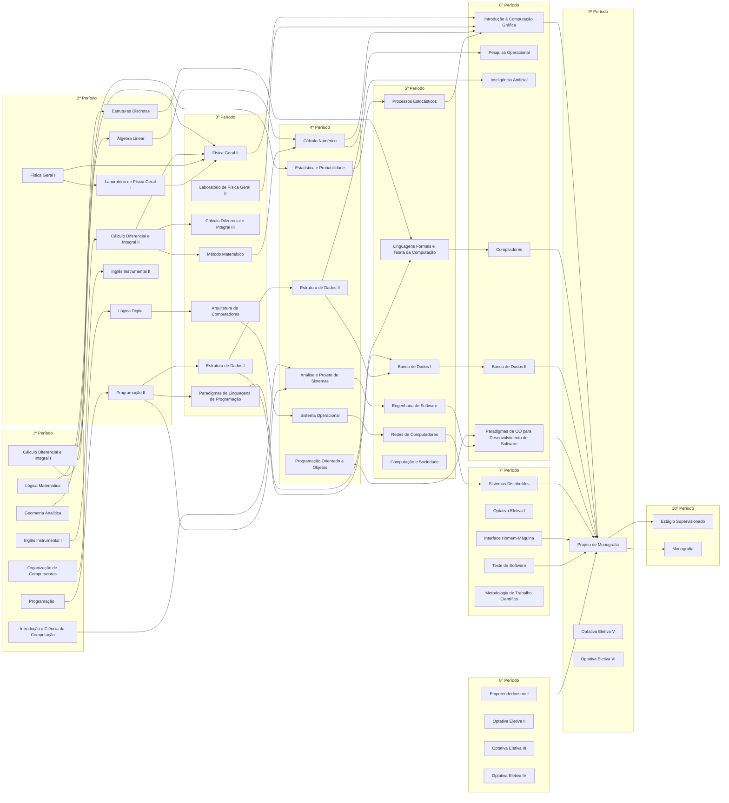

# UENF - Organização de Disciplinas

## 🚨 Alerta 🚨

**Os conteúdos das disciplinas estão privados. Para ter acesso à eles, favor solicitar à [João Vítor Fernandes Dias][LinkGitHub_jvfd3] para te convidar para a organização.**

[Link de atalho para chamar no WhatsApp][LinkWhatsApp]

## Objetivo

Esta organização visa disponibilizar conteúdos de disciplinas da UENF de forma pública. Sendo inicialmente criado por [João Vítor Fernandes Dias][LinkGitHub_jvfd3] e (idealmente) mantido por alunos que já cursaram e ainda cursam cursos na [UENF][LinkUENF], principalmente os alunos de [Ciências da Computação na UENF][LinkCCUENF], dada a expectativa da familiaridade de uso com ferramentas como o [GitHub][LinkGitHub].

[Outra fonte de materiais da UENF][LinkPasseiDireto].

## Disciplinas por período - 2019

| 1º Período                                  | 2º Período                                   | 3º Período                                    | 4º Período                                | 5º Período                                   | 6º Período                                      | 7º Período                                   | 8º Período                 | 9º Período                     | 10º Período                     |
| ------------------------------------------- | -------------------------------------------- | --------------------------------------------- | ----------------------------------------- | -------------------------------------------- | ----------------------------------------------- | -------------------------------------------- | -------------------------- | ------------------------------ | ------------------------------- |
| [Geometria Analítica][01_GA]                | [Algebra Linear][02_AL]                      | [Método Matemático][03_MM]                    | [Cálculo Numérico][04_CN]                 |                                              | [Pesquisa Operacional][06_PO]                   |                                              | [Empreendedorismo I][08_E] |                                |                                 |
| [Cálculo Diferencial e Integral I][01_CDI1] | [Cálculo Diferencial e Integral II][02_CDI2] | [Cálculo Diferencial e Integral III][03_CDI3] | [Estatística e Probabilidade][04_EP]      | [Processos Estocásticos][05_PE]              | [Introdução à Computação Gráfica][06_ICG]       |                                              | Optativa Eletiva II        |                                |                                 |
|                                             | [Física Geral I][02_FG1]                     | [Física Geral II][03_FG2]                     | [Sistema Operacional][04_SO]              | [Redes de Computadores][05_RC]               |                                                 | [Sistemas Distribuídos][07_SD]               | Optativa Eletiva III       | Optativa Eletiva V             |                                 |
|                                             | [Laboratório Física Geral I][02_LFG1]        | [Laboratório Física Geral II][03_LFG2]        |                                           | [L. Formais e Teoria da Computação][05_LFTC] | [Compiladores][06_C]                            | Optativa Eletiva I                           | Optativa Eletiva IV        | Optativa Eletiva VI            |                                 |
| [Organiza. de Computadores][01_OC]          | [Lógica Digital][02_LD]                      | [Arquit. de Computadores][03_AC]              |                                           |                                              |                                                 |                                              |                            |                                |                                 |
| [Lógica Matemática][01_LM]                  | [Estruturas Discretas][02_ED]                | [Paradigmas de Lings de Programação][03_PLP]  | [Estrutura de dados II][04_ED2]           | [Banco de Dados I][05_BD1]                   | [Banco de Dados II][06_BD2]                     |                                              |                            |                                | [Estágio Supervisionado][10_ES] |
| [Programação I][01_P1]                      | [Programação II][02_P2]                      | [Estrutura de Dados I][03_ED1]                | [Programação Orientado a Objetos][04_POO] |                                              | [Inteligência Artificial][06_IA]                | [Interface Homem-Máquina][07_IHM]            |                            | [Projeto de Monografia][09_PM] | [Monografia][10_M]              |
| [Introdução à Ciência da Computação][01_IC] |                                              |                                               | [Análise e Projeto de Sistemas][04_APS]   | [Engenharia de Software][05_ES]              | [Parad. OO para Desenv. de Software][06_POO_SW] | [Teste de Software][07_TS]                   |                            |                                |                                 |
| [Inglês Instrumental I][01_I1]              | [Inglês Instrumental II][02_I2]              |                                               |                                           | [Computação e Sociedade][05_CS]              |                                                 | [Metodologia de Trabalho Científico][07_MTC] |                            |                                |                                 |

[01_GA]: <https://github.com/UENF-Organizacao-de-Disciplinas/MAT01117-Geometria_Analitica_e_Vetores>
[01_CDI1]: <https://github.com/UENF-Organizacao-de-Disciplinas/MAT01101-Calculo_Diferencial_e_Integral_I>
[01_OC]: <https://github.com/UENF-Organizacao-de-Disciplinas/INF01105-Organizacao_de_Computadores>
[01_LM]: <https://github.com/UENF-Organizacao-de-Disciplinas/MAT01104-Logica_Matematica>
[01_P1]: <https://github.com/UENF-Organizacao-de-Disciplinas/INF01106-Programacao_I>
[01_IC]: <https://github.com/UENF-Organizacao-de-Disciplinas/INF01101-Introducao_a_Ciencia_da_Computacao>
[01_I1]: <https://github.com/UENF-Organizacao-de-Disciplinas/LEL04102-Ingles_Instrumental_I>

[02_AL]: <https://github.com/UENF-Organizacao-de-Disciplinas/MAT01212-Algebra_Linear>
[02_CDI2]: <https://github.com/UENF-Organizacao-de-Disciplinas/MAT01203-Calculo_Diferencial_e_Integral_II>
[02_FG1]: <https://github.com/UENF-Organizacao-de-Disciplinas/FIS01202-Fisica_Geral_I>
[02_LFG1]: <https://github.com/UENF-Organizacao-de-Disciplinas/FIS01204-Laboratorio_de_Fisica_Geral_I>
[02_LD]: <https://github.com/UENF-Organizacao-de-Disciplinas/INF01104-Logica_Digital>
[02_ED]: <https://github.com/UENF-Organizacao-de-Disciplinas/INF01207-Estruturas_Discretas>
[02_P2]: <https://github.com/UENF-Organizacao-de-Disciplinas/INF01209-Programacao_II>
[02_I2]: <https://github.com/UENF-Organizacao-de-Disciplinas/LEL04206-Ingles_Instrumental_II>

[03_AC]: <https://github.com/UENF-Organizacao-de-Disciplinas/INF01112-Arquitetura_de_Computadores>
[03_CDI3]: <https://github.com/UENF-Organizacao-de-Disciplinas/MAT01105-Calculo_Diferencial_e_Integral_III>
[03_ED1]: <https://github.com/UENF-Organizacao-de-Disciplinas/INF01114-Estruturas_de_Dados_I>
[03_FG2]: <https://github.com/UENF-Organizacao-de-Disciplinas/FIS01103-Fisica_Geral_II>
[03_LFG2]: <https://github.com/UENF-Organizacao-de-Disciplinas/FIS01109-Laboratorio_de_Fisica_Geral_II>
[03_MM]: <https://github.com/UENF-Organizacao-de-Disciplinas/MAT01106-Metodos_Matematicos>
[03_PLP]: <https://github.com/UENF-Organizacao-de-Disciplinas/INF01113-Paradigmas_de_Linguagens_de_Programacao>

[04_APS]: <https://github.com/UENF-Organizacao-de-Disciplinas/INF01201-Analise_e_Projeto_de_Sistemas>
[04_CN]: <https://github.com/UENF-Organizacao-de-Disciplinas/MAT01208-Calculo_Numerico>
[04_ED2]: <https://github.com/UENF-Organizacao-de-Disciplinas/INF01202-Estrutura_de_Dados_II>
[04_EP]: <https://github.com/UENF-Organizacao-de-Disciplinas/MAT01201-Estatistica_e_Probabilidades>
[04_POO]: <https://github.com/UENF-Organizacao-de-Disciplinas/INF01203-Programacao_Orientada_a_Objetos>
[04_SO]: <https://github.com/UENF-Organizacao-de-Disciplinas/INF01204-Sistema_Operacional>

[05_BD1]: <https://github.com/UENF-Organizacao-de-Disciplinas/INF01116-Banco_de_Dados_I>
[05_CS]: <https://github.com/UENF-Organizacao-de-Disciplinas/LES04536-Computacao_e_Sociedade>
[05_ES]: <https://github.com/UENF-Organizacao-de-Disciplinas/INF01119-Engenharia_de_Software>
[05_LFTC]: <https://github.com/UENF-Organizacao-de-Disciplinas/INF01117-Linguagens_Formais_e_Teoria_da_Computacao>
[05_PE]: <https://github.com/UENF-Organizacao-de-Disciplinas/MAT01107-Processos_Estocasticos>
[05_RC]: <https://github.com/UENF-Organizacao-de-Disciplinas/INF01115-Redes_de_Computadores>

[06_BD2]: <https://github.com/UENF-Organizacao-de-Disciplinas/INF01206-Banco_de_Dados_II>
[06_C]: <https://github.com/UENF-Organizacao-de-Disciplinas/INF01212-Compiladores>
[06_IA]: <https://github.com/UENF-Organizacao-de-Disciplinas/INF01205-Inteligencia_Artificial>
[06_ICG]: <https://github.com/UENF-Organizacao-de-Disciplinas/INF01124-Introducao_a_Computacao_Grafica>
[06_PO]: <https://github.com/UENF-Organizacao-de-Disciplinas/INF01211-Pesquisa_Operacional>
[06_POO_SW]: <https://github.com/UENF-Organizacao-de-Disciplinas/INF01210-Paradigma_Orientado_a_Objetos_para_Desenvolvimento_de_Software>

[07_IHM]: <https://github.com/UENF-Organizacao-de-Disciplinas/INF01123-Interface_Homem_Maquina>
[07_MTC]: <https://github.com/UENF-Organizacao-de-Disciplinas/PRO01122-Metodologia_Cientifica_para_Engenharia_de_Producao>
[07_SD]: <https://github.com/UENF-Organizacao-de-Disciplinas/INF01122-Sistemas_Distribuidos>
[07_TS]: <https://github.com/UENF-Organizacao-de-Disciplinas/INF01121-Teste_de_Software>

[08_E]: <https://github.com/UENF-Organizacao-de-Disciplinas/PRO01540-Empreendedorismo>

[09_PM]: <https://github.com/UENF-Organizacao-de-Disciplinas/INF01130-Projeto_de_Monografia>

[10_ES]: <https://github.com/UENF-Organizacao-de-Disciplinas/INF01127-Estagio_Supervisionado>
[10_M]: <https://github.com/UENF-Organizacao-de-Disciplinas/INF01131-Monografia>

### Eletivas Livres e Optativas

- Eletivas Livres
  - [Topicos Especiais em Filosofia - Teoria da Decisão][Link_Livre_01]
  - [Portugues Instrumental I][Link_Livre_02]
  - [Teoria Geral da Administração][Link_Livre_03]
  - [Sociologia][Link_Livre_04]
  - [T e E Economia - Introdução a Economia][Link_Livre_05]
  - [Energia e Meio Ambiente][Link_Livre_06]
- Eletivas Optativas
  - [Topicos Especiais em Inteligencia Artificial II - Sistemas Inteligentes][Link_Optat_01]
  - [Topicos Especiais em Simulacao Computacional II - Heuristicas e Complexidade][Link_Optat_02]
  - [Topicos Especiais em Computacao II - Programacao de Aplicacoes de Microcontrolador Digital][Link_Optat_03]
  - [Topicos Especiais em Sistemas Operacionais][Link_Optat_04]
  - [Fundamentos de Processamento de Imagens][Link_Optat_05]

[Link_Optat_01]: <INF01133-Topicos_Especiais_em_Inteligencia_Artificial_II_-_Sistemas_Inteligentes>
[Link_Optat_02]: <INF01218-Topicos_Especiais_em_Simulacao_Computacional_II_Heuristicas_e_Complexidade>
[Link_Optat_03]: <INF01226-Topicos_Especiais_em_Computacao_II_Programacao_de_Aplicacoes_de_Microcontrolador_Digital>
[Link_Optat_04]: <INF01240-Topicos_Especiais_em_Sistemas_Operacionais>
[Link_Optat_05]: <INF01220-Fundamentos_de_Processamento_de_Imagens>

[Link_Livre_01]: <LCL14006-Top_Especiais_em_Filosofia_Teoria_da_Decisao>
[Link_Livre_02]: <LEL04101-Portugues_Instrumental_I>
[Link_Livre_03]: <LGP04001-Teoria_Geral_da_Administracao>
[Link_Livre_04]: <LGP04022-Sociologia>
[Link_Livre_05]: <LGP14012-T_e_Economia_Introducao_a_Economia>
[Link_Livre_06]: <LMT01310-Energia_e_Meio_Ambiente>

## Grafo de disciplinas

## To-Do List

- [ ] Conferir arquivos no classroom, jogar pro github e sair da sala
- [ ] Pegar dados do Docs, Sheets e Slides em formatos docx, xlsx, pptx, pdf
- [ ] Pegar anotações feitas no [Notion](https://jvfd3.notion.site/UENF-ac5aff98cf594da8991dc28f846cf168)
- [ ] Organizar pastas internas mais apropriadamente
- [ ] Adicionar sugestões e dicas de como os professores funcionam e de que forma costumam agir
- [ ] Adicionar ementas para todas as disciplinas
- [ ] Converter txt e docx para markdown
- [ ] Remover arquivos duplicados
- [ ] Adicionar README.md nos que faltaram
- [ ] Criar toggles de matérias por período aqui
- [ ] Também criar toggles de matérias por professor
- [ ] Adicionar emails dos professores
- [ ] Tabelar professores? [Link de Auxílio(?)](https://stackoverflow.com/questions/47344571/how-to-draw-checkbox-or-tick-mark-in-github-markdown-table)
- [ ] Transcrever minhas anotações do papel???!

## Professores

### Obrigatórias

#### Ciência da Computação <!-- 4 -->

- [ ] [Luis Antonio Rivera Escriba][LattesRivera] <!-- rivera@uenf.br -->
  - Prefere não compartilhar por enquanto por causa de erros de gramática e querer ter uma apresentação única
- [ ] [Annabell Del Real Tamariz][LattesAnnabell] <!-- annabell@uenf.br -->
- [ ] [Fermin Alfredo Tang Montané][LattesTang] <!-- tang@uenf.br -->
- [ ] [Ausberto Silverio Castro Vera][LattesAusberto] <!-- ascv@uenf.br --> <!-- LCMAT -->

##### Bolsistas <!-- 6 -->

- [ ] [Átila Carvalho Junior][LattesAtila]
- [ ] [Fábio Machado de Oliveira][LattesFabio]
- [ ] [João Luiz de Almeida Filho][LattesJoaoLuiz]
- [ ] [Carlos Alberto Manso Lopez][LattesCarlos]
- [ ] [Luiz Mauricio de Oliveira Monteiro][LattesLM]
- [ ] [Sânya Carvalho dos Santos Caldeira][LattesSanya]

#### Matemática <!-- 5 -->

- [ ] [Elba Orocia Bravo Asenjo][LattesElba] <!-- elba.bravo@gmail.com --> <!-- LCMAT -->
- [ ] [Mylane dos Santos Barreto][LattesMylane]
- [ ] [Oscar Alfredo Paz La Torre][LattesOscar] <!-- oscar@uenf.br --> <!-- LCMAT -->
- [ ] [Luis Humberto Guillermo Felipe][LattesGuillermo] <!-- guillerm@uenf.br -->
- [ ] [Rigoberto Gregorio Sanabria Castro][LattesRigoberto] <!-- rigobertocastro04@gmail.com --> <!-- LCMAT -->

#### Física <!-- 7 -->

- [ ] [Max Erik Soffner][LattesMax] <!-- mes@uenf.br -->
- [ ] [Marcelo Gomes da Silva][LatesMarceloGomes] <!-- mgs@uenf.br -->
- [ ] [Marcenilda Amorim Lima][LattesMarcenilda]
- [ ] [José Augusto Pedro Lima][LattesZeGuto] <!-- japlima@uenf.br -->
- [ ] [Leonardo Mota de Oliveira][LattesLeo] <!-- mota@uenf.br -->
- [ ] [Roberto Weider de Assis Franco][LattesRobertoFranco] <!-- franco@uenf.br -->
- [ ] [Marcelo Shoey de Oliveira Massunaga][LattesShoey] <!-- shoey@uenf.br -->
<!-- - [ ] [Marcelo de Oliveira Souza][LattesAstronauta] mm@uenf.br -->

#### Outras matérias <!-- 4 -->

- [ ] [José Ramón Arica Chavez][LattesArica] <!-- arica@uenf.br, jose.arica.chavez@gmail.com --> <!-- LEPROD -->
- [ ] [Edson Terra Azevedo Filho][LattesEdson] <!-- etaf@uenf.br  , edsonterrafilho@gmail.com --> <!-- LEPROD, LGPP -->
- [ ] [Manuel Antonio Molina Palma][LattesMolina] <!-- LEPROD -->
- [ ] [Pedro Paulo Pinto Maia Filho][LattesPedroPaulo]

### Eletivas <!-- 6 -->

- [ ] LGP14012 - Economia - [Guilherme Vasconcelos Pereira][LattesGuilherme]
- [ ] LGP04022 - Sociologia - [Joao Ricardo Boechat Pires de Almeida Sales][LattesBoechat]
- [ ] LGP04001 - Administração - [Chesil Batista Silva][LattesChesil]
- [ ] LCL14006 - Teoria da Decisão - [Carlos Eduardo Batista de Sousa][LattesCarlosEduardo] - [Site][LinkCarlosEduardo]
- [ ] LEL04101 - Português Instrumental - [Jaqueline Maria de Almeida][LattesJaqueline]
- [ ] LMT01310 - Energia e meio ambiente - [Eliane Barbosa Santos][LattesEliane]

[LattesLM]:             http://lattes.cnpq.br/6222563458861842
[LattesLeo]:            http://lattes.cnpq.br/8119272967700641
[LattesMax]:            http://lattes.cnpq.br/5294781291958691
[LattesElba]:           http://lattes.cnpq.br/8819066025912342
[LattesTang]:           http://lattes.cnpq.br/9974379145983363
[LattesOscar]:          http://lattes.cnpq.br/2448699193711406
[LattesShoey]:          http://lattes.cnpq.br/7302577637950656
[LattesFabio]:          http://lattes.cnpq.br/2688606582146646
[LattesAtila]:          http://lattes.cnpq.br/4365020483514414
[LattesArica]:          http://lattes.cnpq.br/2774664527261102
[LattesEdson]:          http://lattes.cnpq.br/7666677740215248
[LattesSanya]:          http://lattes.cnpq.br/4085481702181393
[LattesMolina]:         http://lattes.cnpq.br/6034302026767691
[LattesMylane]:         http://lattes.cnpq.br/7018843980700014
[LattesZeGuto]:         http://lattes.cnpq.br/2746858124459124
[LattesEliane]:         http://lattes.cnpq.br/1517641534499568
[LattesCarlos]:         http://lattes.cnpq.br/9204385052448978
[LattesChesil]:         http://lattes.cnpq.br/6312131273293418
[LattesRivera]:         http://lattes.cnpq.br/6277334830315068
[LattesBoechat]:        http://lattes.cnpq.br/0431659567271611
[LattesAnnabell]:       http://lattes.cnpq.br/7484786835288826
[LattesJoaoLuiz]:       http://lattes.cnpq.br/2752038796773129
[LattesAusberto]:       http://lattes.cnpq.br/5716122572035460
[LattesGuillermo]:      http://lattes.cnpq.br/5592157199814909
[LattesJaqueline]:      http://lattes.cnpq.br/1971913582907475
[LattesGuilherme]:      http://lattes.cnpq.br/6272649442107303
[LattesRigoberto]:      http://lattes.cnpq.br/3844823051682851
[LattesMarcenilda]:     http://lattes.cnpq.br/8531997680500054
[LattesPedroPaulo]:     http://lattes.cnpq.br/4368839025919696
<!-- [LattesAstronauta]:     http://lattes.cnpq.br/1488981360251176 -->
[LatesMarceloGomes]:    http://lattes.cnpq.br/0553046070876845
[LattesCarlosEduardo]:  http://lattes.cnpq.br/4648508077667482
[LattesRobertoFranco]:  http://lattes.cnpq.br/5208824640229110
[LinkCarlosEduardo]:    https://sites.google.com/site/carlosebdesousa/

[LinkWhatsApp]:     https://wa.me/5522999599065?text=Me+convida+para+a+organiza%C3%A7%C3%A3o+%22Conte%C3%BAdo+de+Disciplinas%22+no+GitHub%2C+por+favor%3F+Meu+usu%C3%A1rio+no+GitHub+%C3%A9...

[LinkGitHub_jvfd3]: https://github.com/jvfd3
[LinkGitHub]:       https://github.com/
[LinkCCUENF]:       https://cc.uenf.br/
[LinkUENF]:         https://uenf.br/portal/

[LinkPasseiDireto]: https://www.passeidireto.com/busca?q=uenf&tipo=1

## Ementas

 
2005

 
2019

 
2024

